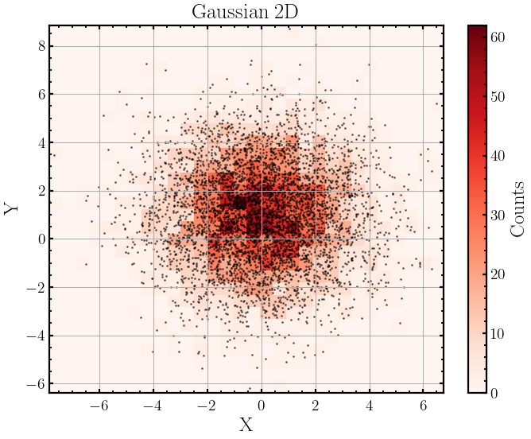

# PonGrid : Probability on Grid
simple code for computing probability on parameter grid and visualization

## Installation
- github (latest) : `pip install -U git+git://github.com/sarashenyy/PonGrid`
- pypi (stable): `pip install pongrid`

## Requirements
- numpy
- scipy
- tqdm
- seaborn
- matplotlib
- (joblib)

## Gaussian2D as an example
### step1. make gaussian2D data
```python
import numpy as np
from scipy.stats import multivariate_normal

np.random.seed(42)
mu1, mu2 = 0, 1 # 均值
sigma1, sigma2 = 2, 2 # 方差
mu_true = [mu1, mu2]  
cov_true = [[sigma1 ** 2, 0], [0, sigma2 ** 2]] 
data = np.random.multivariate_normal(mu_true, cov_true, size=5000)
```


### step2. define posterior function
```python
# 定义 log likelihood 函数
def log_likelihood(theta, data):
    mu1, mu2, sigma1, sigma2 = theta
    cov = [[sigma1 ** 2, 0], [0, sigma2 ** 2]]
    return np.sum(multivariate_normal.logpdf(data, mean=[mu1, mu2], cov=cov))


# 定义 prior 函数
def log_prior(theta):
    mu1, mu2, sigma1, sigma2 = theta
    if sigma1 > 0 and sigma2 > 0:
        return 0.0
    return -np.inf

# 定义 log posterior 函数
def log_posterior_wrapin(theta, data):
    return log_prior(theta) + log_likelihood(theta, data)

# 将数据包装进 log_posterior() 中，以便于后续被 PonGrid 调用，具体见 example/ex_grid_gaussian2D.py
def log_posterior(theta):
    return log_posterior_wrapin(theta, data)
```

### step3. define the parameter range you want
```python
from pongrid import PonGrid
pg = PonGrid(
    param_num=4,
    param_name=['mu1', 'mu2', 'sigma1', 'sigma2'],
    param_range=[[-0.5, 0.5, 0.05], # start, end, step
                 [0.5, 1.5, 0.05],
                 [1.5, 2.5, 0.05],
                 [1.5, 2.5, 0.05]]
)
```

### step4. run grid
```python
joint_log_posterior = pg.run_grid(
    log_posteriord=log_posterior)

# save joint_log_likelihood if needed
joblib.dump(joint_log_posterior, 'ex_gridpost_gaussian2D.joblib')
# if you want to read
# joint_log_likelihood = joblib.load('ex_gridpost_gaussian2D.joblib')
```

### step5. check log(posterior) values
Because `np.exp()` can only maintain calculation accuracy in **[-745, 705]**,
we need to shift the log(posterior) value by adding a max number to the whole
if they are smaller than **-745**.
The recommand shift value is 10.
```python
joint_posterior, joint_posterior_shifted = pg.check_log_posterior(shift=True, shifted_to=10)
```


### step6. draw probability on grid
```python
pg.show_grid_probability(
    figpath='ex_gridres_gaussian2D.png',  # save fig path
    labels=['$\mu_1$', '$\mu_2$', '$\sigma_1$', '$\sigma_2$'],
    truths=[mu1, mu2, sigma1, sigma2] 
    )
```


### mcmc results
```python
import emcee
import corner

# 使用 emcee 进行采样
ndim = 4  # 参数维度
nwalkers = 32  # 行走者数量
nsteps = 5000  # 步数

# 初始化行走者的起始位置
p0 = np.random.rand(nwalkers, ndim)

# 创建采样器
sampler = emcee.EnsembleSampler(nwalkers, ndim, log_posterior, args=[data])
sampler.run_mcmc(p0, nsteps, progress=True)

samples= sampler.get_chain(flat=True, discard=2000)
fig = corner.corner(
    samples, 
    truths=[mu1, mu2, sigma1, sigma2],
    labels=['$\mu_1$', '$\mu_2$', '$\sigma_1$', '$\sigma_2$'],
    quantiles=[0.16, 0.5, 0.84],
    show_titles=True,
    title_kwargs={'fontsize': 18},
    # title_fmt='.2f'
)
fig.savefig('ex_mcmc_gaussian2D.png')
```

